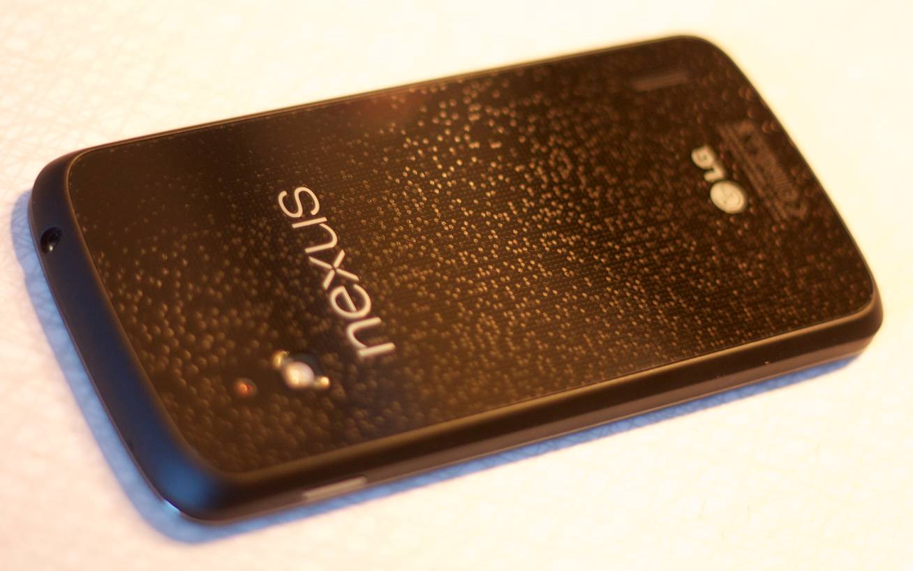
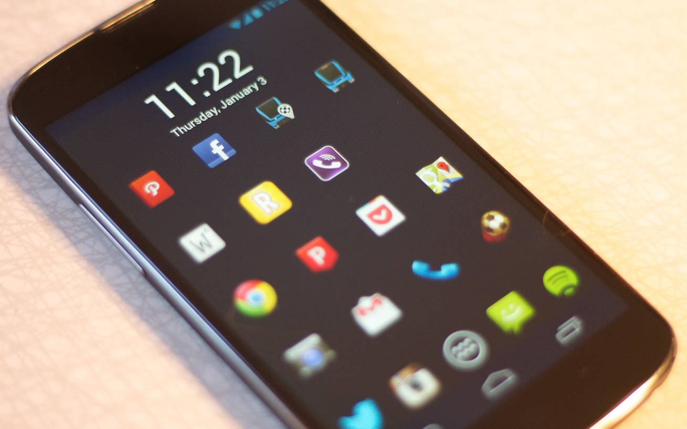
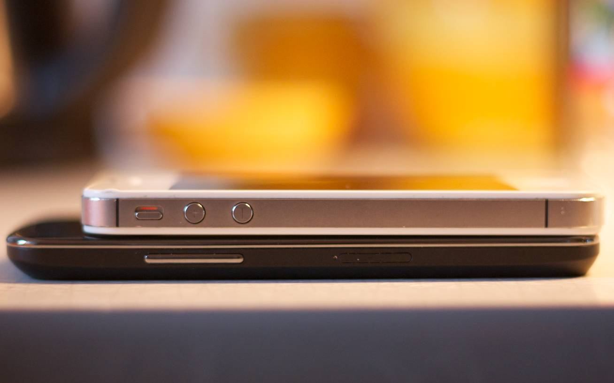

I've been a happy iPhone owner since I got an iPhone 3GS back in 2009. I did switch to Android and a [Samsung Galaxy Ace][1] (running Android 2.3) for a short while, but switched back when the iPhone 4S came out. So, I'm familiar with what Android was a year and a half ago, but I'm heavily invested in the Apple/iOS ecosystem.

Three things has kept me from considering switching to Android so far:

1. I hate what handset makers do to the OS, with custom skins, crappy apps that can't be uninstalled and delayed OS updated. I still would not consider getting any other Android phone than a Nexus.
2. The hardware has been far from Apple's standards. Phones have been too big, too ugly, and felt too cheap.
3. A smooth interface without lag is extremely important on touch devices. Much more so than on normal computers. Android has always had major issues with laggy animations.

Still, I'm been curious of the state of Android and since I've had major issues with battery life on my iPhone, when the upportunity came along to try the brand new Nexus 4 with Android 4.2 I was more than happy to give it a try.

## Hardware

The Nexus 4 is really good looking. And more importantly, it feels good. It's nice to hold, with a rubber edge running along the side of the device and a glass back to feels solid. There are no removable parts except for the micro-sim tray, which has a similar construction to that of an iPhone.

The front is basically just a big (1280x768, 4.7") display. A gorgeous display, definitely on par with the iPhone. The speaker is barely visible at the top of the device and there are no hardware buttons. And this has actually been a problem for me. Many times when I pick the device out of my pocket it takes me a while to realize I'm holding it upside down. I suppose I'll learn eventually to feel the side for the power button, but it has been a bit of an annoyance.

A lot has already been written about the hologram-ish finish on the back. It's good looking, it feel nice to hold and will probably break if you drop the phone.

There's one physical button on each side of the phone. The one on the left controls volume and the right one is a power switch. On the bottom there's a micro USB slot, which is quite horrible to use. I really see why Apple went with the reversible Lightning connector instead.

The Nexus 4 doesn't feel as big as I would have expected, probably because it's a bit slimmer than the iPhone.

Still, a 4.7" screen is too big for me, as I have normal size hands. Reaching the top corners without changing the grip is impossible. I can't understand why there are no high-end Android phones with smaller screen.

## Software

Android has come a long way since 2.3, which is the last version I had used. Everything in the OS runs smooth, even though the touch response isn't as good as on iOS. It's pretty easy to get stuff on the home screens arranged the way I want it, though I did replace the default launcher with [Nova Launcher][2], which provides some more customization options. I also promptly installed [SwiftKey][3], which was the one thing I've probably missed the most from Android when I was on iPhone.

The notification drawer is much better than the one on iOS. I really like the "swipe to dismiss/remove" gesture that is becoming a standard at least on Android. Widgets are also nice, even though I don't use more than a few, and easy access to common settings is very convenient. But I think I like the most about Android is the possiblity to choose your own default apps.

One thing I do miss though is the rubber band effect when scrolling at the end of lists, but I suppose the ommision of that is due to Apple's patents in the area (even though their validity are disputed). Another thing that really bothers me are that the button bar (with home, back and multitasking buttons) move to the other side of the phone when you rotate the screen. There are some other small annoyances, but overall Android feels as good as iOS.

### The App problem

But a phone is nothing without apps. The default apps are nice, and I haven't replaced that many. Some of them, like Gmail & Chrome, are better than their iOS counterparts. Play Store is quite nice, and it's awesome to be able to install stuff onto the phone straight from the computer. Also, the new guidelines that came with Android 4.0 are pretty nice, and apps that use them are often a pleasure to use.

Unfortunately, most apps are laggy and downright ugly. This starts already at the home screen, where a lot of apps (even "big" ones like Path, Flickr and Runkeeper) don't have icons in the right resolution which leaves them blurry. And even if they have the right resolution many of them are smaller than they should be, and a lot of them are pretty ugly. In general, app icons would benefit from some solid guidelines.

And although most of the apps I use frequently on my iPhone have counterparts that are as good (or even better), there are a couple of apps I've really come to miss. The most important is Tweetbot. And although there are a bunch of "ok" Android Twitter clients, none of them are even close to being as solid as Tweetbot. Reeder is another app that has no solid replacement. [Press][4] is beautiful, but lacks some crucial features.

And so it goes. Some "smaller" apps that I really like, Timehop, Want/Svpply, Skala are iOS only, and some, like Ruzzle, are pretty much unusable on Android.

## Conclusion

Android has caught up with iOS. Maybe it's already passed it. The problem is neither the apps nor the hardware that comes with it has. The hardware is close, the people that like huge diplays might even prefer the Nexus 4 hardware over an iPhone. But the app ecosystem still has a pretty long way to go.

I will probably go back to using my iPhone in a couple of weeks, and my next phone will probably be an iPhone, but I've come to like the Nexus 4 for its gorgeous display, solid build quality and some of the nice things in Android.

Two things are still keeping me from becoming a full-time Android user:

1. Lack of great apps. The only app I "love" on Android is Chrome. A lot of apps are good, but too many are crap or not availible.
2. I want a high-end phone with a smaller display. The 4.7" size which has become standard on Android is simply too big for most people.

But Apple needs to be on their toes. As mobile OS:es are expected to manage more and more of the things we now do on our computers, the flexibility of Android will be an advantage, and Windows is lurking around the corner.

The mobile war is still very much ongoing.

[1]: http://www.samsung.com/galaxyace/ace_overview.html
[2]: http://novalauncher.com
[3]: http://www.swiftkey.net/en/
[4]: http://twentyfivesquares.com/press/
